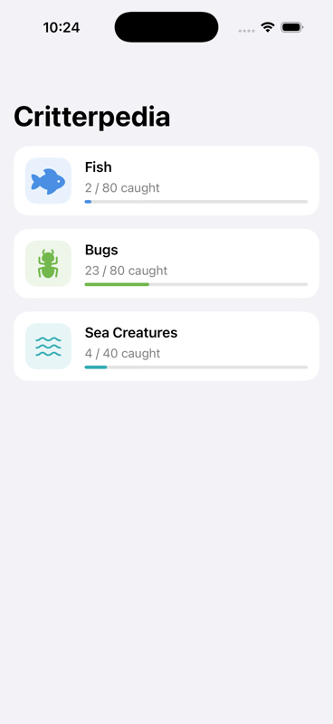
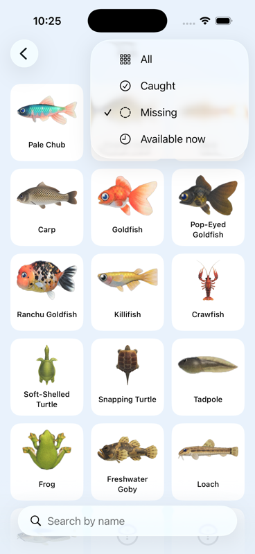
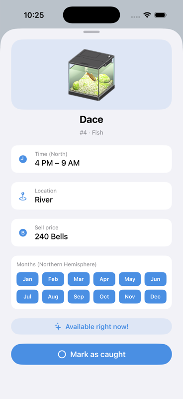
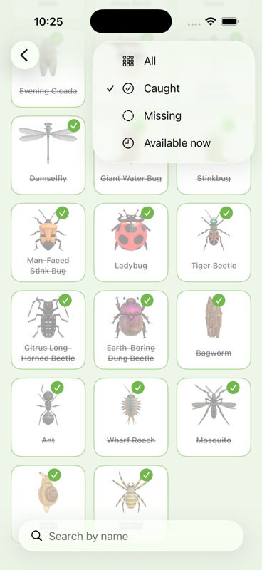
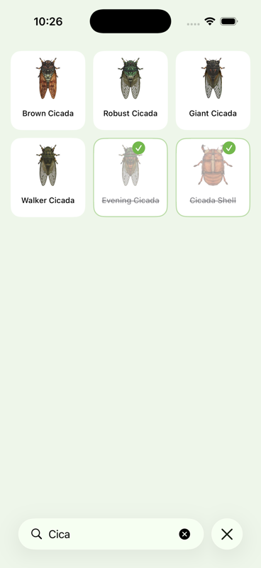

# 🐟 ACNH Critterpedia Tracker

An offline iOS companion app for Animal Crossing: New Horizons that answers two questions in seconds, **what am I missing** and **how do I catch it**.

Built with SwiftUI. Designed for and tested with one very real user, my sister.

> 📖 **Read the full [UX Case Study](CaseStudy.md)**, from problem framing to design decisions and outcomes.

## Demo

https://github.com/user-attachments/assets/ee20d1e9-f393-445f-a04a-7221f0808958

## The problem

The in-game Critterpedia does not travel well. Away from that screen, players forget which species they still need, catch duplicates, and have to dig through external wikis to learn when and where each critter appears. The result, my sister stopped trying to complete her collections.

## The solution

A second screen checklist with the catching knowledge built in.

| Progress at a glance | Scan for gaps | Everything to catch it |
|---|---|---|
|  |  |  |

| Filters that match real questions | Find any critter by name |
|---|---|
|  |  |

- **Critterpedia style grid** with per-category theme colors, fish, bugs and sea creatures.
- **Caught species appear struck through, dimmed and badged**, missing ones stay at full opacity.
- **Detail card** with month chips, active hours, location and sell price, Northern Hemisphere.
- **Available right now** badge and filter, computed live from the current month and hour.
- **Long press to mark as caught**, with haptic feedback, no navigation needed.
- **100% offline data.** The full catalog of 200 critters ships inside the app as bundled JSON, no API, no loading states, instant launch.
- **iPhone and iPad**, with a sidebar split view layout on iPad.

## Architecture

```
CritterpediaTrackerApp.swift   → app entry, injects CaughtStore
Models.swift                   → Critter, CritterType, bundle data loader
CaughtStore.swift              → caught set, persisted with UserDefaults
CritterListViewModel.swift     → filters (all, caught, missing, available now) + search
HomeView.swift                 → NavigationSplitView, category cards with progress
CritterListView.swift          → adaptive grid, long press toggle, filter menu
CritterDetailCard.swift        → detail sheet with month chips and availability badge
Data/*.json                    → offline catalog (80 fish, 80 bugs, 40 sea creatures)
```

No third party dependencies. Pure SwiftUI and Foundation.

## Running it

1. Clone the repo and open the project in Xcode 15 or later.
2. Select a simulator or your device, then run with ⌘R.

That is all, there are no API keys and no configuration. Data loads from the bundled JSON files.

## Data source

Critter data comes from the open source community dataset [Norviah/animal-crossing](https://github.com/Norviah/animal-crossing) (MIT), a JSON export of the community ACNH data spreadsheet. Since the game catalog has been static since 2021, the data is bundled at build time.

## Disclaimer

Unofficial fan project with no affiliation to Nintendo. Animal Crossing is a trademark of Nintendo. Critter images are loaded from the community CDN for personal, non-commercial use.

---

Made by [Ale Gudiel](https://github.com/alegudiel)
